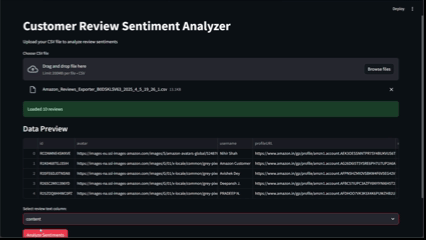
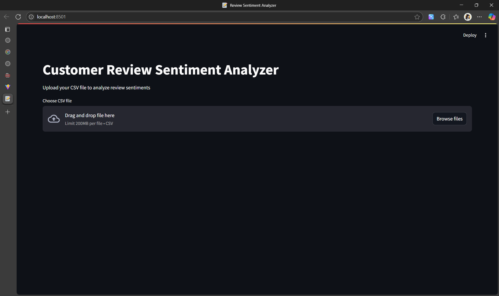
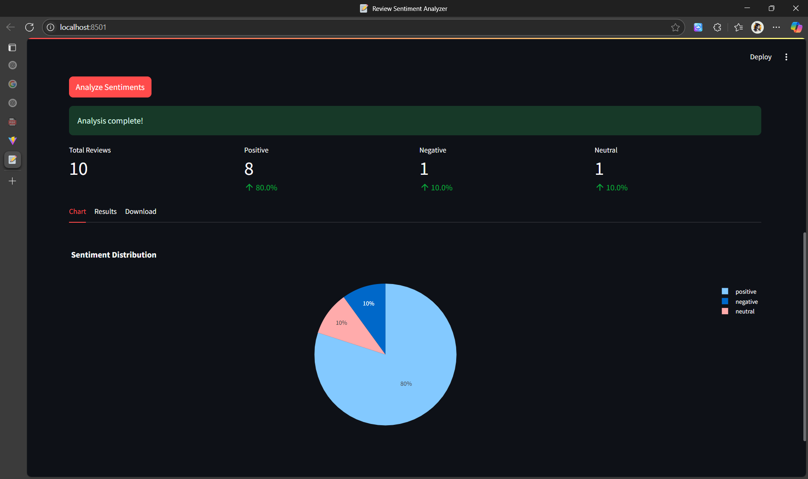

# Customer Review Sentiment Analyzer 📝

A Streamlit web app that analyzes sentiment in reviews using AI. Upload CSV files and get instant sentiment analysis with interactive charts.

> **Note**: This project was created earlier and is now being uploaded to GitHub.

## Demo



## Screenshots

| Main Page | Results |
|-----------|---------|
|  |  |

## Features

- Upload CSV files with review data
- AI-powered sentiment analysis (Positive/Negative/Neutral)
- Interactive pie chart visualizations
- Filter and browse results
- Download analyzed data as CSV
- Real-time progress tracking

## Installation

1. Clone the repository:
```bash
git clone https://github.com/yourusername/amazon-review-sentiment-analyzer.git
cd amazon-review-sentiment-analyzer
```

2. Install dependencies:
```bash
pip install streamlit pandas transformers plotly torch
```

3. Run the app:
```bash
streamlit run app.py
```

## Usage

1. **Upload**: Choose a CSV file with review text
2. **Select**: Pick the column containing reviews
3. **Analyze**: Click "Analyze Sentiments" and wait for results
4. **Explore**: View charts, filter results, and download data

## CSV Format

Your CSV should have at least one text column:
```csv
review_text,rating
"Great product!",5
"Poor quality",1
```

## Model

Uses Cardiff NLP's Twitter-RoBERTa model (`cardiffnlp/twitter-roberta-base-sentiment-latest`) for accurate sentiment classification with confidence scores.

## Requirements

```
streamlit>=1.28.0
pandas>=1.5.0
transformers>=4.30.0
plotly>=5.15.0
torch>=2.0.0
```


**Built with Streamlit and Transformers**
